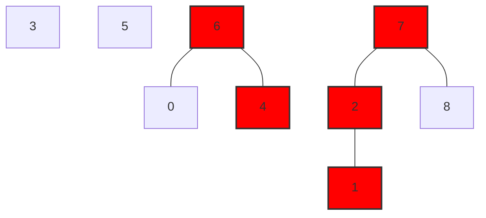
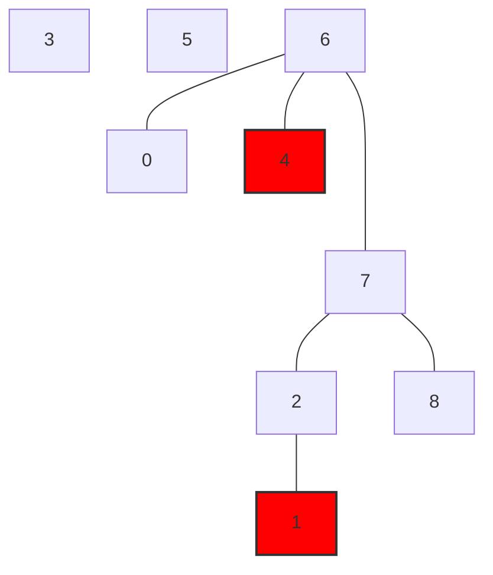

[[_main|<-- Back to main]]

# Dynamic Connectivity
**Union:** connect two objects
**Find:** is there a path connecting the two objects?
**Transitivity:** If *p* is connected to *q* and if *q* is connected to *r*, then *p* is connected to r.
**Connected components:** Maximal set of mutually connected objects

# Disjoint Set (Union-Find) 
#ufds  #union_find #disjoint_set
## Summary
Quick-find is slow:
- Find is fast
- Union is expensive
- Tree is flat
Quick-union is slow:
- Trees too tall (i.e., unbalanced)
- Union ***and*** find are expensive
Weighted-union is faster:
- Trees too balanced: O(log n)
- Union ***and*** find are O(log n)
Weighed Union + Path Compression is very fast:
- Trees very flat
- On average, almost linear performance per operation.

|                                      | find           | union          |
| ------------------------------------ | -------------- | -------------- |
| quick-find                           | O(1)           | O(n)           |
| quick-union                          | O(n)           | O(n)           |
| weighted-union                       | O(log n)       | O(log n)       |
| path compression                     | O(log n)       | O(log n)       |
| weighted-union with path-compression | $\alpha (m,n)$ | $\alpha (m,n)$ |
## Implementation
```cpp
DisjointSet(int N); //constructor: N objects
bool find(Key p, Key q) // are p and q in the same set?
void union(Key p, Key q) // replace sets containing p and q with their union
```
## Quick-Find
#quick_find
**Data Structure:** Array
Two objects are connected if they have the same component identifier.

| Object               | 0   | 1   | 2   | 3   | 4   | 5   | 6   | 7   | 8   |
| -------------------- | --- | --- | --- | --- | --- | --- | --- | --- | --- |
| Component Identifier | 0   | 1   | 1   | 3   | 0   | 1   | 0   | 1   | 3   |

```cpp
// Are p and q in the same set?
// O(1)
find(int p, int q) {
	return (componentId[p] == componentId[q]);
}

// Replace sets containing p and q with their union
// O(n)
union(int p, int q) {
	for (int i = 0; i < componentId.length(); i++){
		if (componentId[i] == componentId[q]) {
			componentId[i] = componentId[p];
		}
	}
}
```
## Quick-Union 
#quick_union
```cpp
// Are p and q in the same set? (Check for same root)
// O(n)
find(int p, int q) {
	while (parent[p] != p) p = parent[p];
	while (parent[q] != q) q = parent[q];
	return (p == q);
}

find(4, 1);
4 -> 6 -> 6
1 -> 2 -> 7 -> 7
return (6 == 7) -> False;
```



```cpp
// Replace sets containing p and q with their union
// O(n)
union(int p, int q) {
	while (parent[p] != p) p = parent[p];
	while (parent[q] != q) q = parent[q];
	parent[p] == q;
}

union(4, 1);
4 -> 6 -> 6
1 -> 2 -> 7 -> 7
parent[7] == 6;
```


## Weighted Union
```cpp
// Determine which tree is more optimal
// Maximum depth of tree is O(log n)
union(int p, int q) {
	while (parent[p] != p) p = parent[p];
	while (parent[q] != q) q = parent[q];
	if (size[p] > size[q]) {
		parent[q] = p; // Link q to p
		size[p] += size[q];
	}
	else {
		parent[p] = q; // Link p to q
		size[q] += size[p];
	}
}
```
### Proof by induction (Tree Height for weighted union)
Base Case: 
- Tree of height
Induction:
- Tree of height $k$ is built from two trees of height $k-1$
- A tree of height $k-1$ contains at least $2^(k-1)$ objects
- Thus, a tree of height $k$ contains $2^k$ objects.
Conclusion: 
- Each tree is of height O(log n)
Therefore, running time of both Find and Union is O(log n).
## Path Compression
>[!THEOREM]
>Starting from empty, any sequence of $m$ union/find operations on $n$ objects takes: $O(n + m \alpha (m,n))$ time, where a is the Inverse Ackerman function.
>
>Basically its impossible to achieve linear time
```cpp
// After finding the root: set the parent of each traversed node to the root
findRoot (int p) {
	root = p;
	while (parent[root] != root) root = parent[root];
	while (parent[p] != p) {
		temp = parent[p]
		parent[p] = root;
		p = temp;
	}
	return root;
}

// Alternate implementation
findRoot (int p) {
	root = p;
	while (parent[root] != root) {
		parent[root] = parent[parent[root]];
		root = parent[root];
	}
	return root;
}
```